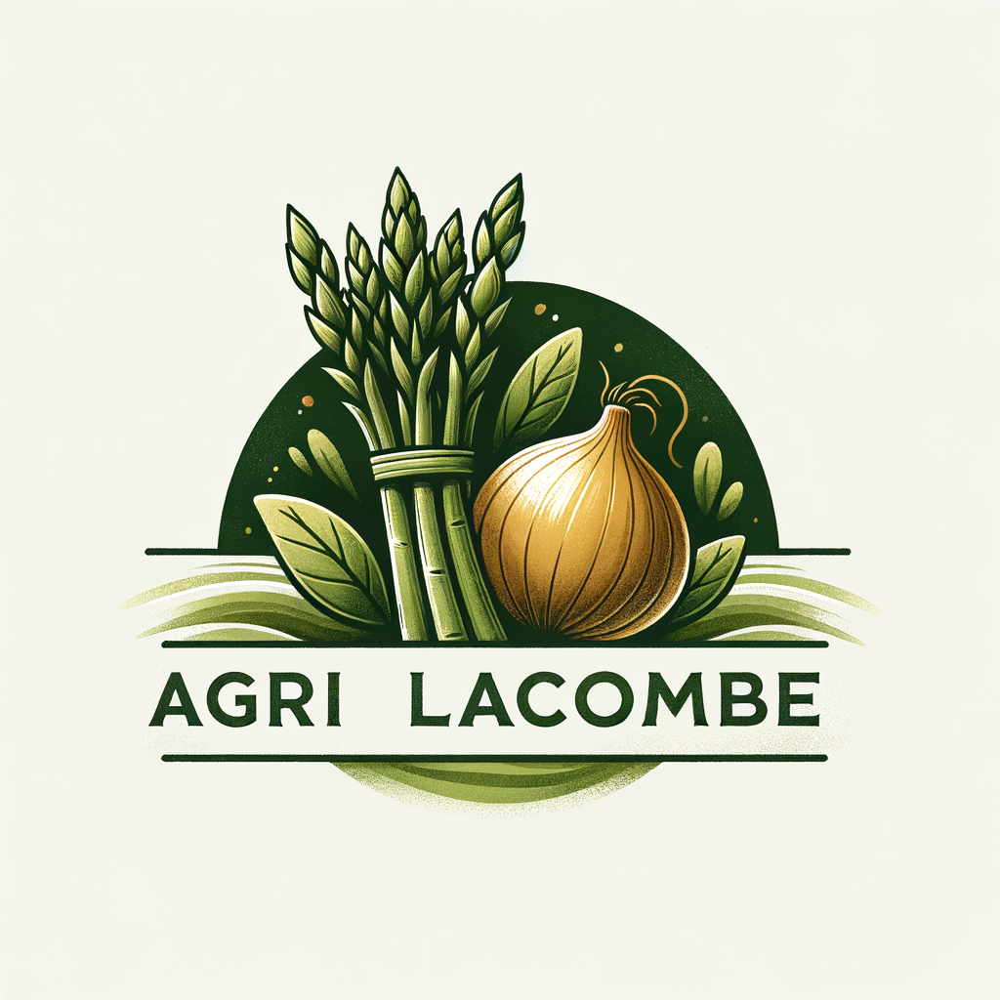

# Bienvenue chez Agri Lacombe! / Welcome to Agri Lacombe!

## Notre Mission / Our Mission

Agri Lacombe est une entreprise familiale moderne, évolutive et résiliente, située sur la Rive-Sud de Montréal, près de Chambly. Sur notre ferme, nous nous spécialisons dans la culture d'asperges de haute qualité et d'oignons espagnols.

Our mission is to establish and operate Agri Lacombe as a modern, evolutive, and resilient family-owned farm located on the South Shore of Montreal (near Chambly). The farm specializes in the cultivation of high-quality asparagus and Spanish onions.

## Notre Vision / Our Vision

Nous aspirons à être un exemple phare d'agriculture durable et efficace. Nous intégrons les meilleures pratiques agricoles avec des méthodologies opérationnelles innovantes, axées sur les données et assistées par l'intelligence artificielle. Notre objectif est d'assurer une production constante, une gérance environnementale responsable et une rentabilité à long terme.

We envision being a leading example of sustainable and efficient agriculture, integrating best practices with innovative, data-driven, and AI-assisted operational methodologies to ensure consistent production, environmental stewardship, and long-term profitability.

## Nos Principes Directeurs / Our Guiding Principles

Nos opérations et notre développement sont guidés par les principes suivants :

Our operations and development are guided by the following principles:

*   🌟 **Qualité et Cohérence / Quality & Consistency:** Un engagement indéfectible à produire des légumes de première qualité. / An unwavering commitment to producing top-quality vegetables.
*   🌿 **Durabilité / Sustainability:** Mise en œuvre de pratiques agricoles respectueuses de l'environnement. / Implementing environmentally sound farming practices.
*   💡 **Efficacité / Efficiency:** Optimisation de l'utilisation des ressources et des flux de travail opérationnels grâce à la technologie et à une planification intelligente. / Optimizing resource use and operational workflows through technology and smart planning.
*   🔄 **Adaptabilité / Adaptability:** Utilisation des données et de l'IA pour répondre de manière proactive aux conditions environnementales et de marché changeantes. / Leveraging data and AI to proactively respond to changing environmental and market conditions.
*   🗣️ **Bilinguisme (Français / Espagnol) / Bilingualism (French / Spanish):** Toutes les communications opérationnelles critiques, la documentation et les supports de formation sont fournis en français et en espagnol pour soutenir efficacement notre main-d'œuvre. / All critical operational communications, documentation, and training materials are provided in both French and Spanish to effectively support our workforce.
*   🔒 **Propriété Intellectuelle / Intellectual Property:** Protection rigoureuse de nos processus exclusifs, de nos données et de nos outils développés sur mesure par des licences strictes. / Rigorous protection of Agri Lacombe's proprietary processes, data, and custom-developed tools through strict licensing.

## Notre Engagement envers la Communauté / Our Commitment to the Community

Bien que nos outils et processus principaux soient propriétaires, nous avons une vision à long terme :

While our core tools and processes are proprietary, we have a long-term vision:

*   🌱 **Contribution Future / Future Contribution:** Nous explorerons les opportunités de partager des outils ou des cadres généralisables et non propriétaires, développés en interne, avec la communauté élargie des technologies agricoles par le biais de publications open-source, lorsque cela sera approprié et stratégiquement aligné. / We will explore opportunities to share generalizable, non-proprietary tools or frameworks developed internally with the broader agricultural technology community through open-source releases when appropriate and strategically aligned.

---

Pour en savoir plus sur nos produits et nos pratiques, visitez notre site web [agrilacombe.com](https://agrilacombe.com).

*This GitHub organization hosts the codebase for our internal management systems, data logging, automation scripts, and eventually, our public-facing website and any open-source contributions.*
